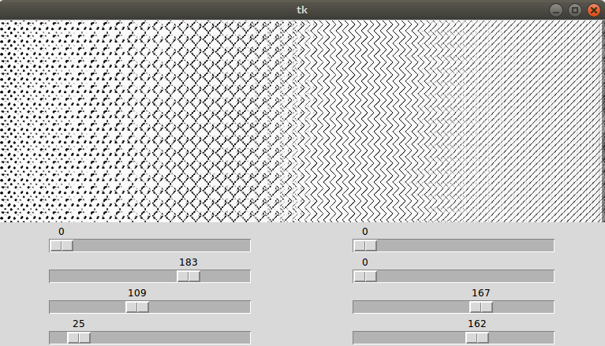
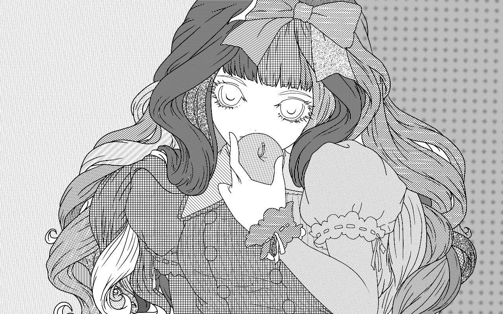
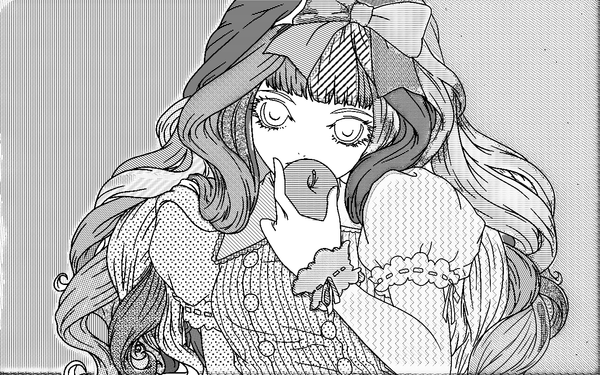

# ScreenVAE

Pytorch implementation for screentone encoding. 
For example, given the manga image with screentone, our model is able to generate feature representations which is plain within the region with same screentone and can also reconstruct the original manga image. 

**Note**: The current software works well with PyTorch 1.1+. 

## Example results


## Prerequisites
- Linux 
- Python 3
- CPU or NVIDIA GPU + CUDA CuDNN


## Getting Started ###
### Installation
- Clone this repo:
```bash
git clone https://github.com/msxie92/ScreenStyle.git
cd ScreenStyle/screenVAE
```
- Install PyTorch and dependencies from http://pytorch.org

### Visulization
- Generate screentones by sampling in the intermediate domain:
```
python visual.py 
```

Examples:



### Screentone Editing
- Edit screentones by modifying the value in the intermediate domain:
```
python edit.py 
```

Examples:




## Models
Download the pre-trained models from [Google Drive](https://drive.google.com/file/d/1QaXqR4KWl_lxntSy32QpQpXb-1-EP7_L/view?usp=sharing) and place under checkpoints/ScreenVAE.


